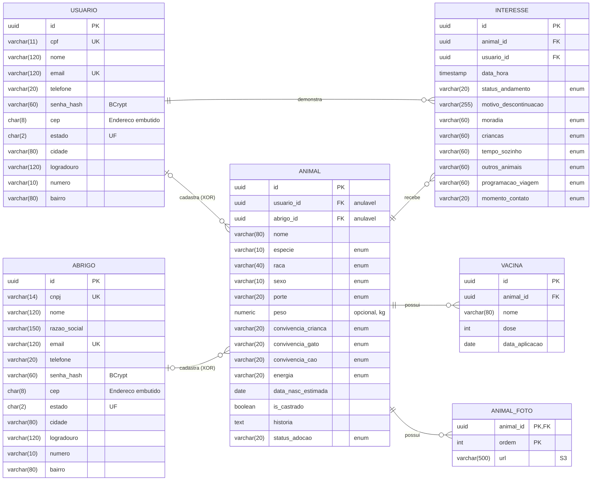
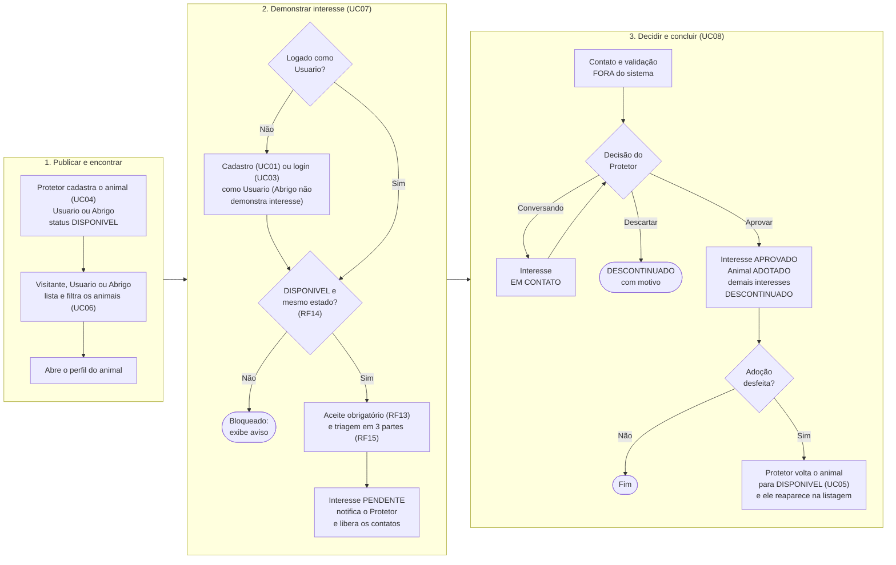
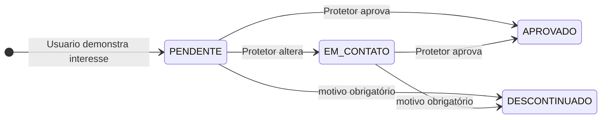
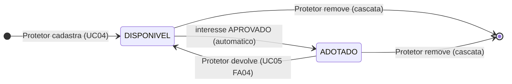
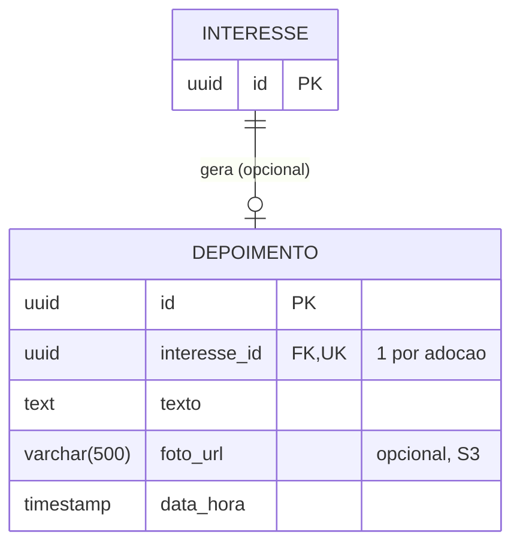

# Adota Aqui — DER conceitual e lógico, domínios, fluxo, estados e rotas

Os blocos `mermaid` abaixo são renderizados automaticamente pelo GitHub (em qualquer `.md` dentro de `docs/`). Também dá para colar o código em mermaid.live e exportar PNG/SVG.

## 1. DER conceitual

Imagem: `der-conceitual-adota-aqui.png` (há também o `.svg`, que abre e edita no Figma ou no draw.io). Notação: cada entidade é um retângulo com seus atributos dentro, e cada relacionamento é um losango com a cardinalidade (mín,máx) de cada lado. A legenda está na própria imagem.

Decisões de modelagem:

- **Espécie e raça** são atributos de `Animal` com valores restritos (enums), porque ambos são filtros da listagem. A raça depende da espécie: no formulário, o usuário escolhe a espécie e só então aparecem as raças dela. O sistema valida que a raça pertence à espécie escolhida (a "Regra" no diagrama). Não há entidade `Raça` porque não existe tela para editar a lista de raças; se um dia existir, ela vira entidade.
- **Interesse** é a entidade associativa do N:M entre Usuario e Animal. Tem identidade e estados próprios.
- **Cadastrante do animal**: exatamente um, Usuario **ou** Abrigo (relacionamentos exclusivos, o arco tracejado).
- **Atributos compostos**: `endereço` (em Usuario e Abrigo), `convivência` (criança, gato, cão) e `triagem` (as 6 respostas do UC07).
- **Multivalorado**: `{fotos}`. Só vira tabela (`animal_foto`) no modelo lógico.
- **Vacina** existe só dentro de um Animal (cardinalidade (1,1) do lado da Vacina).
- Listas fixas de opções (porte, sexo, energia, status, triagem) **não** são entidades: ficam como atributos, e os valores permitidos estão no dicionário de domínios (seção 2).

## 2. Dicionário de domínios

O dicionário de domínios é uma tabela que lista, para cada atributo com opções ou formato restrito, **quais valores ele aceita**. Ele complementa o diagrama: o diagrama mostra a estrutura (quem existe e como se liga), e o dicionário diz o que pode ser guardado em cada campo. Assim o diagrama fica limpo, e o front (opções do `<select>`), o back (enums) e os testes usam a mesma referência.

### Domínios enumerados

| Domínio | Valores permitidos | Onde é usado |
| --- | --- | --- |
| EspecieAnimal | `CAO`, `GATO` | Animal.espécie |
| SexoAnimal | `FEMEA`, `MACHO` | Animal.sexo |
| PorteAnimal (sugerido) | `PEQUENO`, `MEDIO`, `GRANDE` | Animal.porte |
| StatusConvivencia | `CONVIVE_BEM`, `NAO_CONVIVE_BEM`, `NAO_TESTADO` | Animal.convivência (criança, gato, cão) |
| NivelEnergia | `MAIS_ANIMADO`, `MAIS_CALMO` | Animal.energia |
| StatusAdocao | `DISPONIVEL`, `ADOTADO` | Animal.status_adoção |
| StatusInteresse | `PENDENTE`, `EM_CONTATO`, `APROVADO`, `DESCONTINUADO` | Interesse.status_andamento |
| TipoMoradia | `CASA_COM_QUINTAL`, `CASA_SEM_QUINTAL`, `APARTAMENTO_TELADO`, `APARTAMENTO_NAO_TELADO`, `PREFIRO_RESPONDER_DIRETAMENTE_AO_PROTETOR` | triagem.moradia |
| ConvivenciaCrianca | `SIM`, `NAO`, `PREFIRO_RESPONDER_DIRETAMENTE_AO_PROTETOR` | triagem.crianças |
| TempoSozinho | `O_ANIMAL_NAO_FICARA_SOZINHO_EM_CASA`, `ATE_2_HORAS`, `ATE_4_HORAS`, `ATE_8_HORAS`, `MAIS_DE_8_HORAS`, `PREFIRO_RESPONDER_DIRETAMENTE_AO_PROTETOR` | triagem.tempo_sozinho |
| ConvivenciaAnimal | `NAO_TENHO_OUTROS_ANIMAIS_EM_CASA`, `SIM_GATOS`, `SIM_CACHORROS`, `SIM_GATOS_E_CACHORROS`, `SIM_OUTRAS_ESPECIES`, `PREFIRO_RESPONDER_DIRETAMENTE_AO_PROTETOR` | triagem.outros_animais |
| ProgramacaoViagem | `LEVO_O_ANIMAL_COMIGO`, `DEIXO_NOS_CUIDADOS_DE_ALGUEM_DE_CONFIANCA`, `PREFIRO_RESPONDER_DIRETAMENTE_AO_PROTETOR` | triagem.programação_viagem |
| MomentoContato | `MANHA`, `TARDE`, `NOITE`, `QUALQUER_HORARIO` | triagem.momento_contato |
| Raca | lista por espécie (tabela abaixo); cada raça pertence a uma única espécie | Animal.raça |

### Raças por espécie (sugestão inicial; ajustem à vontade)

A raça é um enum no back-end, e cada valor carrega a sua espécie. O front busca as opções filtradas pela espécie escolhida (por exemplo `GET /racas?especie=CAO`), então a lista fica em um só lugar.

| Espécie | Raças |
| --- | --- |
| CAO | `SRD`, `LABRADOR`, `GOLDEN_RETRIEVER`, `PASTOR_ALEMAO`, `POODLE`, `SHIH_TZU`, `YORKSHIRE`, `PINSCHER`, `PIT_BULL`, `ROTTWEILER`, `BULLDOG`, `BEAGLE`, `BORDER_COLLIE`, `HUSKY_SIBERIANO`, `LHASA_APSO`, `MALTES`, `DACHSHUND`, `SPITZ_ALEMAO`, `BOXER`, `CHIHUAHUA`, `COCKER_SPANIEL`, `PUG`, `SCHNAUZER`, `OUTRA` |
| GATO | `SRD`, `SIAMES`, `PERSA`, `ANGORA`, `MAINE_COON`, `RAGDOLL`, `BENGAL`, `SPHYNX`, `BRITISH_SHORTHAIR`, `ABISSINIO`, `BIRMANES`, `OUTRA` |

`SRD` significa sem raça definida (vira-lata). `OUTRA` evita travar o cadastro de uma raça que não está na lista. Como `SRD` e `OUTRA` existem para as duas espécies, no código elas ficam como `SRD_CAO`, `SRD_GATO`, `OUTRA_CAO` e `OUTRA_GATO`.

### Regras de formato

| Atributo | Regra |
| --- | --- |
| cpf | 11 dígitos numéricos, único |
| cnpj | 14 dígitos numéricos, único |
| email | formato de e-mail, único |
| telefone | DDD + número, só dígitos |
| senha | guardada como hash BCrypt, nunca em texto puro |
| cep | 8 dígitos |
| estado | UF com 2 letras maiúsculas (preenchida a partir do CEP) |
| cidade, logradouro, bairro | texto, preenchidos a partir do CEP |
| numero | texto curto (aceita "s/n" e complemento) |
| fotos | uma ou mais URLs de imagem (S3); pelo menos 1 (RF16) |
| peso | decimal em kg, maior que 0, opcional |
| data_nasc_estimada | data, não pode ser futura |
| castrado | verdadeiro ou falso |
| dose | inteiro, 1 ou mais |
| data_aplicação | data, não pode ser futura |
| motivo_descontinuação | texto, obrigatório quando o status é `DESCONTINUADO` |

## 3. DER lógico

Convenções: chaves primárias em UUID; `Endereco` é `@Embeddable`, então suas colunas ficam dentro de `usuario` e `abrigo`; enums gravados como texto (`@Enumerated(EnumType.STRING)`); `estado` guardado como UF de 2 letras (vem do CEP).



### Regras de integridade

| Tabela | Regra | Como garantir |
| --- | --- | --- |
| usuario | `cpf` e `email` únicos | `unique = true` na entidade |
| abrigo | `cnpj` e `email` únicos | `unique = true` na entidade |
| animal | a `raca` deve pertencer à `especie` informada | Service (`raca.getEspecie() == especie`), retornando 400 se não bater |
| animal | exatamente um dono: `usuario_id` OU `abrigo_id` (XOR) | `CHECK ((usuario_id IS NOT NULL) <> (abrigo_id IS NOT NULL))` via `@Check` + validação no Service |
| animal | remover o animal remove fotos, vacinas e interesses (UC05) | `cascade = ALL` + `orphanRemoval = true` |
| animal | dono (usuario/abrigo) não é apagado no MVP | FK sem cascade |
| animal_foto | PK composta (`animal_id`, `ordem`); a primeira foto é a capa | `@ElementCollection` + `@OrderColumn` |
| interesse | `motivo_descontinuacao` obrigatório quando `status_andamento = DESCONTINUADO` | `CHECK (status_andamento <> 'DESCONTINUADO' OR motivo_descontinuacao IS NOT NULL)` + Service |
| interesse | um Usuario só pode ter 1 interesse ATIVO (PENDENTE ou EM CONTATO) por animal | Service (`existsBy...StatusIn`) |
| interesse | só 1 interesse APROVADO por animal | Service, dentro da mesma transação que muda o animal para ADOTADO |
| interesse | Usuario não demonstra interesse em animal que ele mesmo cadastrou | Service (`animal.usuario_id <> interesse.usuario_id`) |

Índices sugeridos (o PostgreSQL não cria índice automático em FK): `animal(status_adocao)`, `animal(usuario_id)`, `animal(abrigo_id)`, `interesse(animal_id)`, `interesse(usuario_id)`, `usuario(estado)`, `abrigo(estado)`.

Consulta da listagem (RF07 e RF14), que funciona sem duplicar o estado na tabela `animal`. O filtro por estado só entra para Usuario logado; para Visitante e Abrigo a mesma consulta roda sem essa linha (todos os estados). Os demais filtros (porte, sexo, convivência, cidade) entram do mesmo jeito, como condições opcionais:

```sql
SELECT a.*, COALESCE(u.nome, b.nome) AS protetor
FROM animal a
LEFT JOIN usuario u ON u.id = a.usuario_id
LEFT JOIN abrigo  b ON b.id = a.abrigo_id
WHERE a.status_adocao = 'DISPONIVEL'
  AND COALESCE(u.estado, b.estado) = :estado          -- só para Usuario logado
  AND (:especie IS NULL OR a.especie = :especie)
  AND (:raca    IS NULL OR a.raca    = :raca);
```

## 4. Diagrama de fluxo



## 5. Máquinas de estado

Interesse (quando o Candidato clica em "Desistir da adoção", o registro é excluído, por isso não há estado final para isso):



Animal:



## 6. Tabela de rotas (React Router)

Níveis de acesso: **Pública** (Visitante), **Autenticada** (Usuario ou Abrigo), **Somente Usuario**. O front esconde e redireciona; quem realmente impede o acesso é a API (JWT com perfil + checagem de dono do animal, RNF03), que responde 401/403.

| Rota | Tela | Acesso | Casos de uso / requisitos |
| --- | --- | --- | --- |
| `/` | Home: apresentação e atalhos | Pública | — |
| `/animais` | Listagem com filtros (espécie, raça, porte, sexo, convivência, cidade). Visitante e Abrigo veem todos os estados; só o Usuario logado vê apenas o próprio estado | Pública | UC06, RF07, RF14 |
| `/animais/:id` | Perfil completo do animal. Botão "Demonstrar interesse" só para Usuario do mesmo estado (Abrigo não vê o botão); vira "Desistir da adoção" se já houver interesse | Pública | UC06, UC07 |
| `/animais/:id/interesse` | Aviso de guarda responsável (aceite obrigatório) e triagem em 3 partes | Somente Usuario | UC07, RF13, RF15 |
| `/login` | Login com CPF ou CNPJ e senha | Pública (redireciona se já logado) | UC03, RF03 |
| `/cadastro` | Escolha do tipo de conta | Pública | UC01, UC02 |
| `/cadastro/usuario` | Cadastro de pessoa física | Pública | UC01, RF01 |
| `/cadastro/abrigo` | Cadastro de ONG/abrigo | Pública | UC02, RF02 |
| `/meus-animais` | Animais que eu cadastrei (editar/remover) | Autenticada | UC05 |
| `/meus-animais/novo` | Cadastrar animal (dados, fotos, vacinas) | Autenticada | UC04, RF04, RF05, RF16 |
| `/meus-animais/:id/editar` | Editar ou remover. Se ADOTADO, só o status é editável | Autenticada + dono do animal | UC05, RF06 |
| `/interesses-recebidos` | Painel dos interesses nos meus animais: contatos, status, aprovar/descontinuar | Autenticada (Protetor) | UC08, RF09, RF10 |
| `/meus-interesses` | Interesses que eu demonstrei, com status e opção de desistir (sugerida) | Somente Usuario | UC07 |
| `/minhas-adocoes` | Adoções concluídas e depoimento (opcional) | Somente Usuario | UC09, RF11 |
| `*` | Página não encontrada | Pública | — |

No React, isso vira três tipos de rota: as públicas soltas, um `RotaProtegida` sem restrição de perfil (`/meus-animais/*`, `/interesses-recebidos`) e um `RotaProtegida` que exige perfil USUARIO (`/animais/:id/interesse`, `/meus-interesses`, `/minhas-adocoes`).

## 7. Extensão opcional: Depoimento (UC09, RF11)

Fora do DER principal, porque só entra se sobrar tempo. Se entrar, é uma tabela nova ligada ao `interesse` (que já liga Usuario e Animal), sem mexer nas tabelas existentes.



Regras: só quem tem o interesse APROVADO pode registrar (Service confere `interesse.status = APROVADO` e `interesse.usuario` = usuário logado); o texto é obrigatório e a foto é opcional; e a remoção do animal continua em cascata (animal → interesse → depoimento). A rota `/minhas-adocoes` da seção 6 é a tela dessa extensão.
