# Funcionalidades implementadas

O que já funciona no Adota Aqui: o que cada funcionalidade faz, como ela funciona por dentro (tela, API e banco), as regras que ela segue e onde ficam o código e os testes.

Situação em 08/10/2026, fim da Sprint 3. A regra é a mesma do resto da pasta: entrou funcionalidade nova, entra uma seção nova aqui, no mesmo PR.

Os prints foram tirados com os dados de exemplo do projeto (`frontend/src/mocks`), por isso os animais aparecem sem foto. No site, as fotos vêm do Amazon S3.

## Sumário

1. [Cadastro de conta](#1-cadastro-de-conta)
2. [Login, sessão e saída](#2-login-sessão-e-saída)
3. [Controle de acesso](#3-controle-de-acesso)
4. [Vitrine de animais](#4-vitrine-de-animais)
5. [Perfil do animal](#5-perfil-do-animal)
6. [Cadastro, edição e remoção de animal (CRUD)](#6-cadastro-edição-e-remoção-de-animal-crud)
7. [Demonstrar interesse e desistir](#7-demonstrar-interesse-e-desistir)
8. [Painel de interesses recebidos](#8-painel-de-interesses-recebidos)
9. [O que vale pro sistema todo](#9-o-que-vale-pro-sistema-todo)
10. [O que ainda não está pronto](#10-o-que-ainda-não-está-pronto)

## Quem usa o sistema

| Perfil | Como entra | O que pode fazer |
| --- | --- | --- |
| Visitante | Sem login | Ver a vitrine (animais de todos os estados) e o perfil de cada animal |
| Usuario | Pessoa física, login com CPF | Ver os animais do próprio estado, demonstrar interesse e desistir. Também pode cadastrar animais que resgatou e cuidar dos interesses recebidos |
| Abrigo | ONG ou abrigo, login com CNPJ | Ver a vitrine de todos os estados, cadastrar animais e cuidar dos interesses recebidos. Não demonstra interesse |

**Protetor** é quem cadastrou o animal, seja Usuario ou Abrigo.

## Resumo

| # | Funcionalidade | Requisitos | Telas | Endpoints |
| --- | --- | --- | --- | --- |
| 1 | Cadastro de conta | RF01, RF02, RNF02 | `/cadastro`, `/cadastro/usuario`, `/cadastro/abrigo` | `POST /api/usuarios`, `POST /api/abrigos` |
| 2 | Login, sessão e saída | RF03, RNF03 | `/login`, `/perfil` | `POST /api/auth/login` |
| 3 | Controle de acesso | RNF03, RF14 | Todas | Todos |
| 4 | Vitrine de animais | RF07, RF14 | `/`, `/animais` | `GET /api/animais`, `GET /api/racas` |
| 5 | Perfil do animal | RF07, RF14 | `/animais/:id` | `GET /api/animais/{id}` |
| 6 | CRUD de animal e fotos | RF04, RF05, RF06, RF16 | `/meus-animais`, `/meus-animais/novo`, `/meus-animais/:id/editar` | `GET /api/animais/meus`, `POST /api/animais`, `PUT /api/animais/{id}`, `DELETE /api/animais/{id}`, `POST /api/fotos` |
| 7 | Demonstrar interesse e desistir | RF08, RF09, RF13, RF14, RF15 | `/animais/:id/interesse` | `POST /api/animais/{id}/interesses`, `DELETE /api/interesses/{id}` |
| 8 | Painel de interesses recebidos | RF09, RF10, RF12 | `/interesses-recebidos` | `GET /api/interesses/recebidos`, `PATCH /api/interesses/{id}/status` |

Os detalhes de cada endpoint (entrada, saída e erros) estão no [contrato da API](api.md).

---

## 1. Cadastro de conta

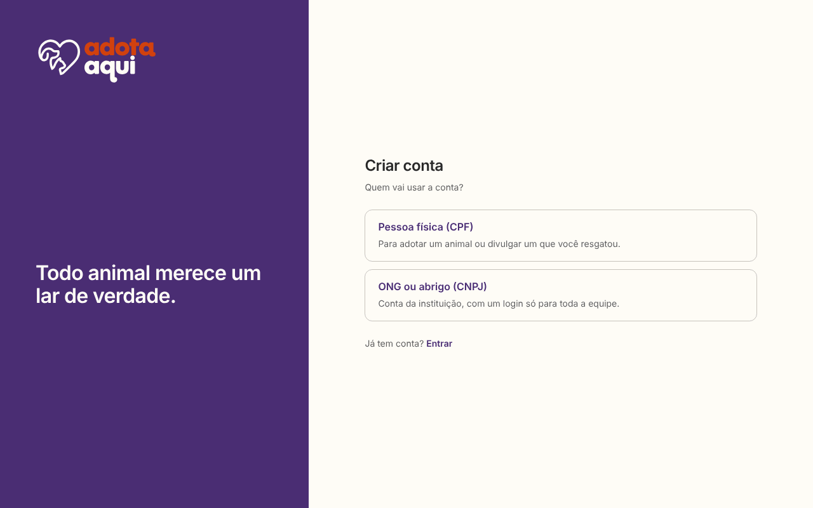

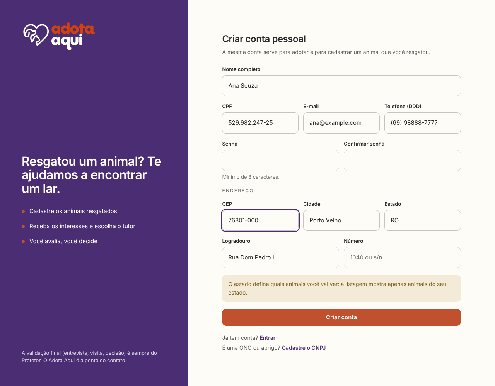

**O que faz.** Cria a conta de uma pessoa física (Usuario, com CPF) ou de uma ONG ou abrigo (Abrigo, com CNPJ). A mesma conta de pessoa física serve pra adotar e pra divulgar um animal que a pessoa resgatou.

**Como funciona.**

1. Em `/cadastro`, a pessoa escolhe "Pessoa física (CPF)" ou "ONG ou abrigo (CNPJ)".
2. Preenche o formulário:
   - Pessoa física: nome completo, CPF, e-mail e telefone.
   - Abrigo: CNPJ, nome institucional, razão social, e-mail institucional e telefone.
   - Os dois: senha, confirmação da senha e endereço.
3. Ao digitar os 8 números do CEP, o front consulta o ViaCEP e preenche logradouro, cidade e estado. Os campos continuam editáveis. Se o CEP não existir, aparece "CEP não encontrado. Confira os números.".
4. O front confere tudo antes de enviar e manda só os números de CPF, CNPJ, telefone e CEP.
5. O back confere de novo, guarda a senha criptografada com BCrypt e responde `201` já com o token de login. A pessoa entra direto, sem precisar fazer login, e vai pra vitrine.

**Regras e validações.**

- CPF e CNPJ têm os dígitos verificadores conferidos no front e no back, com o mesmo cálculo. Números repetidos, como 111.111.111-11, são recusados. Erro do back: `400` "CPF inválido" ou "CNPJ inválido".
- Senha de 8 a 72 caracteres, e a confirmação precisa ser igual ("As senhas não conferem.").
- Telefone com DDD: 10 ou 11 números. CEP: 8 números. Estado: sigla de 2 letras. Número do endereço obrigatório.
- Documento que já tem conta: `409` "Já existe uma conta cadastrada com este CPF" (ou CNPJ).
- E-mail que já tem conta, olhando as duas tabelas (uma pessoa e um abrigo não podem usar o mesmo e-mail): `409` "Já existe uma conta cadastrada com este e-mail". O e-mail é guardado em minúsculas.
- Os erros aparecem embaixo do campo certo, e o foco vai pro primeiro campo com erro.
- A pessoa física vê o aviso de que o estado do endereço define quais animais ela vai ver (RF14).

**Como fica no banco.** Tabelas `usuario` e `abrigo`, com id UUID, documento único (`cpf` com 11 caracteres, `cnpj` com 14), e-mail único e `senha_hash`, que guarda o resultado do BCrypt e nunca a senha. O endereço (CEP, estado, cidade, logradouro, número e bairro) fica em colunas da própria tabela.

**Onde está no código.**

- Front: `pages/EscolhaCadastro`, `pages/CadastroUsuario`, `pages/CadastroAbrigo`, `components/FormularioCadastro`, `components/CamposEndereco`, `services/viacep.js`, `utils/validacoes.js` e `utils/mascaras.js`
- Back: `AuthController`, `CadastroService`, `CadastroUsuarioRequest`, `CadastroAbrigoRequest`, `EnderecoDto` e `SecurityConfig` (BCrypt)

**Testes.** `AutenticacaoIntegrationTest` (cadastro dos dois tipos, documento e e-mail repetidos, dígito verificador errado, confirmação de senha), `DtoValidationTest`, `Cadastro.test.jsx` (CEP, senhas diferentes, erro 409 no campo certo) e `Validacoes.test.jsx` (máscaras, CPF e CNPJ).

---

## 2. Login, sessão e saída

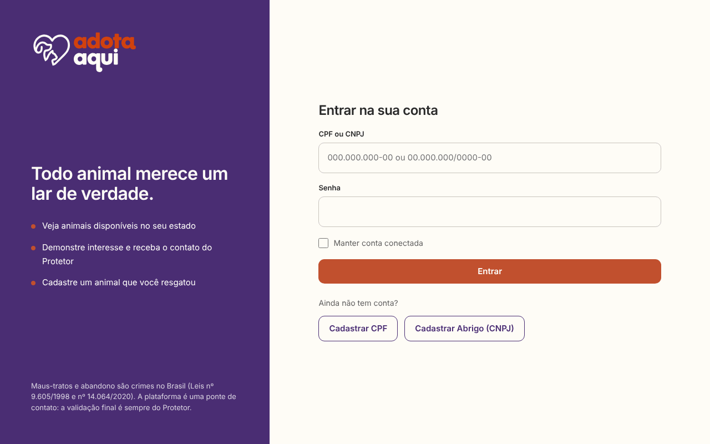

**O que faz.** Entra na conta com CPF ou CNPJ e senha. O sistema descobre o tipo de conta pela quantidade de números: 11 é CPF e 14 é CNPJ (RF03).

**Como funciona.**

1. O campo "CPF ou CNPJ" usa a máscara de CPF até o 11º número e troca pra de CNPJ depois disso.
2. O back procura a conta na tabela certa e compara a senha com o `senha_hash` usando o BCrypt.
3. Deu certo: o back devolve um token JWT válido por 24 horas, junto com o tipo de conta, o id e o nome.
4. O front guarda essa sessão. Com "Manter conta conectada" marcado, ela fica no `localStorage` e continua lá depois de fechar o navegador. Sem marcar, fica no `sessionStorage` e some quando a aba fecha.
5. Toda chamada que precisa de login manda o token no cabeçalho `Authorization: Bearer ...`.
6. Quando o token vence, o front sai da conta sozinho. Se a API responder `401` no meio do uso, o front também sai.
7. Depois do login, a pessoa volta pra página que tentou abrir, ou vai pra vitrine.
8. Pra sair: avatar com as iniciais, no topo, e depois "Sair da conta".

**Regras.**

- Senha errada e conta que não existe dão a mesma resposta: `401` "Documento ou senha inválidos". Assim ninguém descobre quais CPFs têm conta.
- Documento que não tem 11 nem 14 números: `400`.
- O token guarda só o id da conta e o tipo (USUARIO ou ABRIGO). CPF e CNPJ não vão no token.

**Onde está no código.**

- Front: `pages/Login`, `contexts/AuthContext.jsx`, `services/autenticacao.js`, `components/Navbar` e `pages/Perfil`
- Back: `AuthController`, `AutenticacaoService`, `JwtService`, `JwtAuthenticationFilter` e `SecurityConfig`

**Testes.** `AutenticacaoIntegrationTest` (mesma mensagem pros dois erros, token inválido ou vencido, token sem documento), `Login.test.jsx`, `AuthContext.test.jsx` e `Navbar.test.jsx`.

---

## 3. Controle de acesso

**O que faz.** Garante que cada perfil só faça o que pode, na tela e na API. Quem manda é a API: o front só esconde o que não faz sentido mostrar.

**No front.**

- As rotas que precisam de login (`/meus-animais`, cadastro e edição de animal, `/interesses-recebidos` e `/perfil`) passam pela `RotaProtegida`. Sem login, a pessoa vai pro `/login` e volta pra mesma página depois de entrar.
- Demonstrar interesse e Minhas candidaturas são só pra pessoa física. Abrigo que tenta abrir essas páginas vai pra página inicial.
- O menu muda conforme quem está logado. Visitante vê "Cadastrar" e "Entrar". Quem está logado vê "Explorar", "Meus animais", "Interesses recebidos" e, só pessoa física, "Minhas candidaturas".

**Na API.**

- Públicos: login, os dois cadastros, a vitrine, o perfil do animal e a lista de raças. O resto exige token.
- Sem token: `401` "Autenticação necessária". Token inválido ou vencido: `401` "Token inválido ou expirado".
- O papel (`ROLE_USUARIO` ou `ROLE_ABRIGO`) vem do token. Antes de editar, remover ou mudar um status, o service confere se a conta é a dona do animal. Quem não é recebe `403`.
- CORS: a API só aceita chamadas dos endereços configurados em `CORS_ORIGENS` (o site e os deploy previews do Netlify).

**Onde está no código.** `routes/RotaProtegida.jsx` e `routes/AppRoutes.jsx` no front. `SecurityConfig`, `JwtAuthenticationFilter` e `ErroSegurancaHandler` no back.

**Testes.** `AuthContext.test.jsx` (redireciona pro login, bloqueia abrigo), `App.test.jsx`, `AutenticacaoIntegrationTest` (CORS e token) e os testes de dono em `AnimalIntegrationTest` e `InteresseIntegrationTest`.

---

## 4. Vitrine de animais

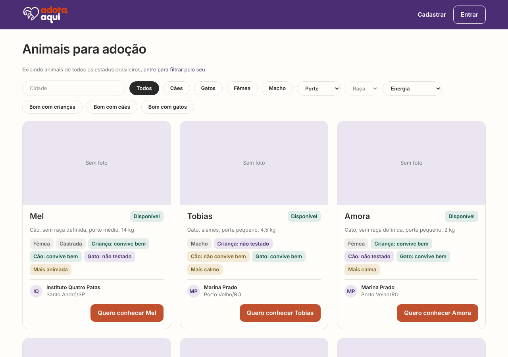

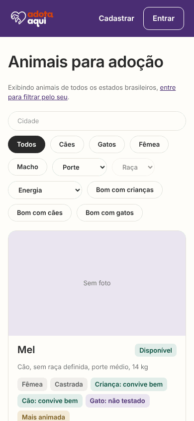

**O que faz.** Lista os animais disponíveis pra adoção, com filtros (RF07, UC06). Aparece na página inicial e em `/animais`.

**Como funciona.**

1. Visitante e Abrigo veem animais de todos os estados. Pessoa física logada vê só os do próprio estado (RF14). O estado do animal é o estado de quem cadastrou.
2. Filtros: cidade, espécie, sexo, porte, raça (liberada depois de escolher a espécie), nível de energia e convivência ("Bom com crianças", "Bom com cães", "Bom com gatos").
3. A cada mudança, o front espera 300 ms sem mudança nova (assim não busca a cada letra digitada na cidade) e chama `GET /api/animais` com os filtros no endereço.
4. Cada cartão mostra nome, descrição (espécie, raça, porte e peso), tags de convivência, o protetor com cidade e estado, e o botão "Quero conhecer".
5. Sem resultado com os filtros: "Nenhum resultado encontrado com essas informações.", com o botão "Ver todos os animais" (UC06 FA02). Sem nenhum animal no estado da pessoa: "Nenhum animal disponível no seu estado no momento." (UC06 FA01).

**Busca por cidade.** Acha por parte do nome e ignora acentos e maiúsculas: "sao" acha "São Paulo". O back tira os acentos do que foi digitado e, no banco, compara com a cidade também sem acento (`translate` e `lower`), usando `LIKE` com o texto no meio. Funciona igual no PostgreSQL e no H2 dos testes.

**Onde está no código.**

- Front: `components/VitrineAnimais`, `components/FiltrosAnimais`, `components/CardAnimal` e `services/animais.js`
- Back: `AnimalController`, `AnimalService`, `AnimalFiltroRequest` e `AnimalSpecifications`

**Testes.** `AnimalIntegrationTest` (estado, status, filtros combinados, cidade sem acento), `ErroApiIntegrationTest` (filtro com valor inválido), `VitrineAnimais.test.jsx` e `CardAnimal.test.jsx`.

---

## 5. Perfil do animal

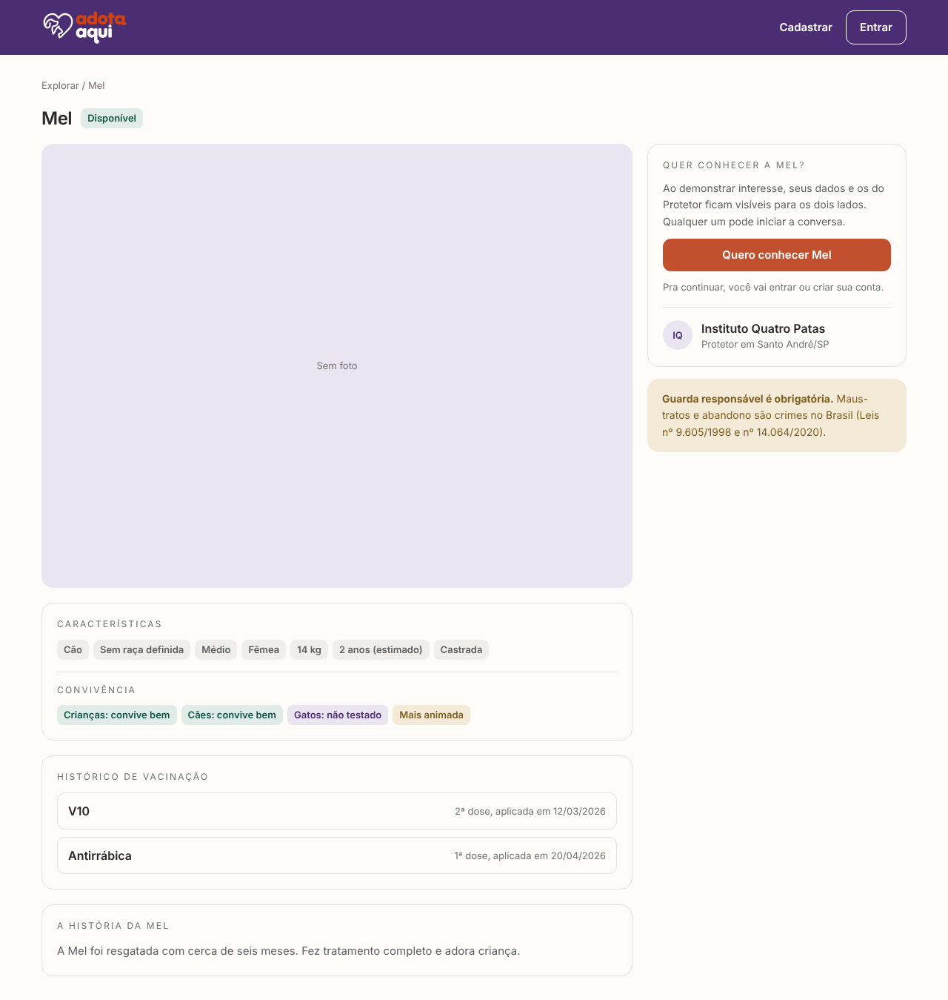

**O que faz.** Mostra tudo sobre um animal: fotos, características, convivência, vacinas e a história. O quadro do lado muda conforme quem está vendo.

**Como funciona.**

- Galeria com a foto principal grande e miniaturas clicáveis.
- Características: espécie, raça, porte, sexo, peso, idade estimada (calculada pela data de nascimento estimada) e se é castrado.
- Convivência com crianças, cães e gatos em tags coloridas (verde: convive bem; amarelo: não convive bem; roxo: não testado), e o nível de energia.
- Histórico de vacinação, quando tem, e a história do animal.
- Aviso de guarda responsável no fim.

O quadro do lado:

| Quem vê | O que aparece |
| --- | --- |
| Visitante | "Quero conhecer {nome}", que leva ao login |
| Pessoa física do mesmo estado | "Quero conhecer {nome}" |
| Pessoa física com interesse em andamento | O status do interesse e "Desistir da adoção" |
| Pessoa física de outro estado | Aviso de que a adoção acontece dentro do mesmo estado |
| Abrigo | Aviso de que conta de abrigo não demonstra interesse |
| Protetor do animal | "Editar {nome}" e "Ver interesses recebidos" |

**Regras.** O back já manda o que o front precisa pra decidir o quadro: `ehMeu`, `podeDemonstrarInteresse` e `meuInteresse`. Animal adotado só aparece pro protetor dele. Pros outros, a resposta é `404` "Animal não encontrado".

**Onde está no código.**

- Front: `pages/PerfilAnimal`, `components/GaleriaFotos` e `utils/rotulos.js`
- Back: `AnimalController`, `AnimalService` e `AnimalMapper`

**Testes.** `AnimalIntegrationTest` (permissões e interesse ativo no perfil) e `PerfilAnimal.test.jsx`.

---

## 6. Cadastro, edição e remoção de animal (CRUD)

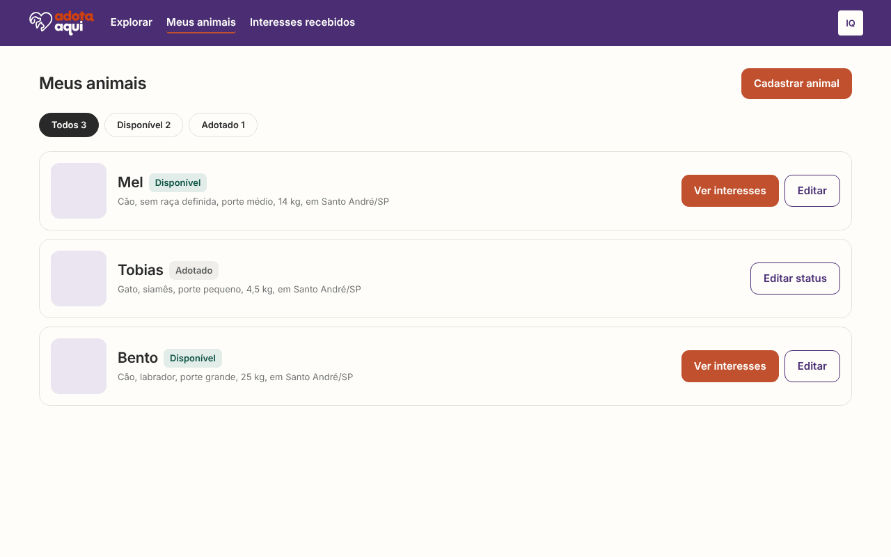

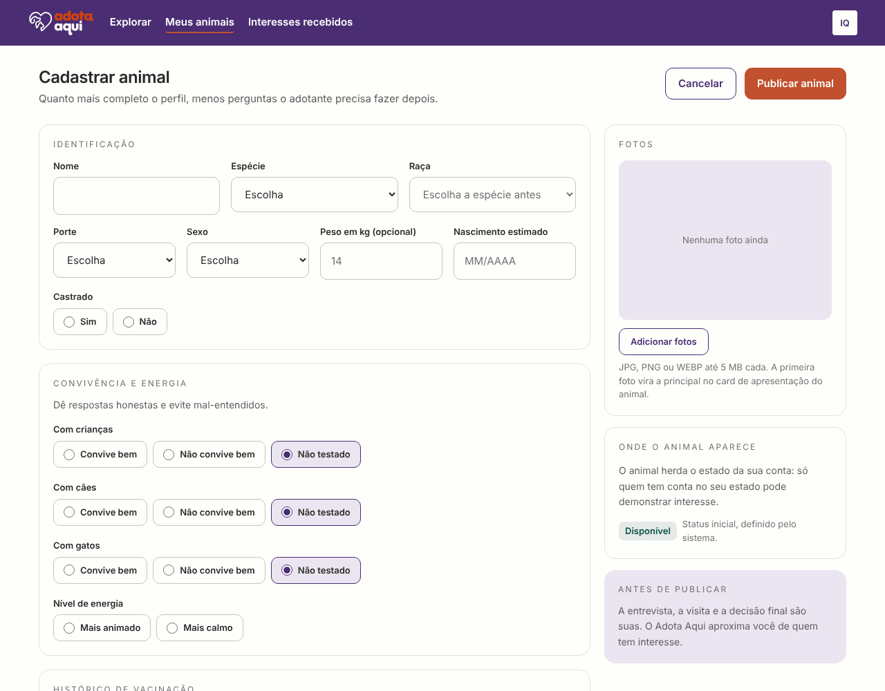

**O que faz.** O protetor, pessoa física ou abrigo, cadastra, vê, edita e remove os animais dele (RF04, RF05, RF06), com fotos (RF16). É o CRUD principal do sistema.

**Cadastrar (create).**

1. Em Meus animais, "Cadastrar animal".
2. O formulário tem partes: identificação (nome, espécie, raça, porte, sexo, peso, nascimento estimado em MM/AAAA e se é castrado), convivência e energia, vacinas (quantas quiser), trajetória do animal e fotos.
3. Cada foto escolhida sobe na hora pro `POST /api/fotos`, que guarda o arquivo no Amazon S3 e devolve o endereço. A primeira é a principal, e dá pra trocar qual é a principal ou remover uma foto.
4. "Publicar animal" manda tudo pro `POST /api/animais`. O animal já nasce Disponível e aparece na vitrine.

**Ver (read).** Meus animais (`GET /api/animais/meus`) lista os animais da conta, disponíveis e adotados, com os filtros Todos, Disponível e Adotado. Animal disponível tem "Ver interesses" e "Editar". Adotado tem "Editar status".

**Editar (update).** O mesmo formulário, já preenchido, manda tudo pro `PUT /api/animais/{id}`.

- Animal disponível: dá pra mudar todos os dados. O status não muda por aqui: o animal só vira Adotado quando o protetor aprova um interesse.
- Animal adotado: os dados ficam travados e só o status muda (RF06). Escolher "Disponível (devolução)" pede confirmação ("Tornar {nome} disponível de novo?") e devolve o animal pra vitrine. A devolução é salva sem mudar os dados (se mudar, o back responde `409`); depois dela, o animal pode ser editado normalmente. O interesse aprovado continua no histórico.

**Remover (delete).** "Remover {nome}" pede confirmação ("Remover {nome} de vez?") e chama `DELETE /api/animais/{id}`. Saem junto as vacinas, os endereços das fotos e os interesses do animal.

Depois de cada ação, Meus animais mostra um aviso: "{nome} foi publicado e já aparece na vitrine.", "As alterações em {nome} foram salvas." ou "{nome} foi removido.".

**Regras e validações.**

- Obrigatórios: nome (até 80 caracteres), espécie, raça, porte, sexo, nascimento estimado, castrado, convivência com crianças, cães e gatos (começa em "Não testado"), nível de energia, trajetória e pelo menos uma foto. O peso é opcional.
- A raça precisa ser da espécie escolhida: `400`, com "A raça não pertence à espécie informada" no campo `racaDaEspecie`, que o front mostra embaixo do campo Raça.
- Nascimento estimado: mês de 01 a 12, ano a partir de 1990 e nunca no futuro. Vacina: nome obrigatório, dose e data opcionais, e data no futuro não vale.
- Fotos: JPG, PNG ou WEBP de até 5 MB. O back confere o tipo pelos primeiros bytes do arquivo, não pelo nome. Renomear um PDF pra .jpg não passa.
- Só o protetor do animal edita ou remove (`403`). Mudar os dados de um animal adotado: `409`. Tentar marcar como adotado pelo formulário: `409` "A adoção deve ser registrada pela aprovação de um interesse".
- Enquanto salva uma edição, o animal fica travado no banco (`SELECT ... FOR UPDATE`), pra não brigar com uma aprovação acontecendo ao mesmo tempo.

**Como fica no banco.** Tabela `animal` (os enums ficam como texto; tem `usuario_id` ou `abrigo_id`, nunca os dois, garantido por um `CHECK`), `animal_foto` (animal, ordem e endereço) e `vacina`. O estado do animal não é guardado: vem do endereço do protetor. As imagens ficam no S3, e o banco guarda só o endereço delas (RF16).

**Onde está no código.**

- Front: `pages/MeusAnimais`, `pages/CadastroAnimal`, `pages/EditarAnimal`, `components/FormularioAnimal`, `components/EnvioFotos`, `components/ListaVacinas`, `utils/formularioAnimal.js` e `services/fotos.js`
- Back: `AnimalController`, `AnimalService`, `AnimalMapper`, `FotoController`, `FotoService` e `ArmazenamentoS3`

**Testes.** `AnimalIntegrationTest` (dono, troca de fotos e vacinas, adotado só muda o status, remoção em cascata), `FotoIntegrationTest` (tipo e tamanho da imagem), `RacaIntegrationTest`, `CadastroAnimal.test.jsx`, `EditarAnimal.test.jsx`, `FormularioAnimal.test.jsx` e `MeusAnimais.test.jsx`.

---

## 7. Demonstrar interesse e desistir

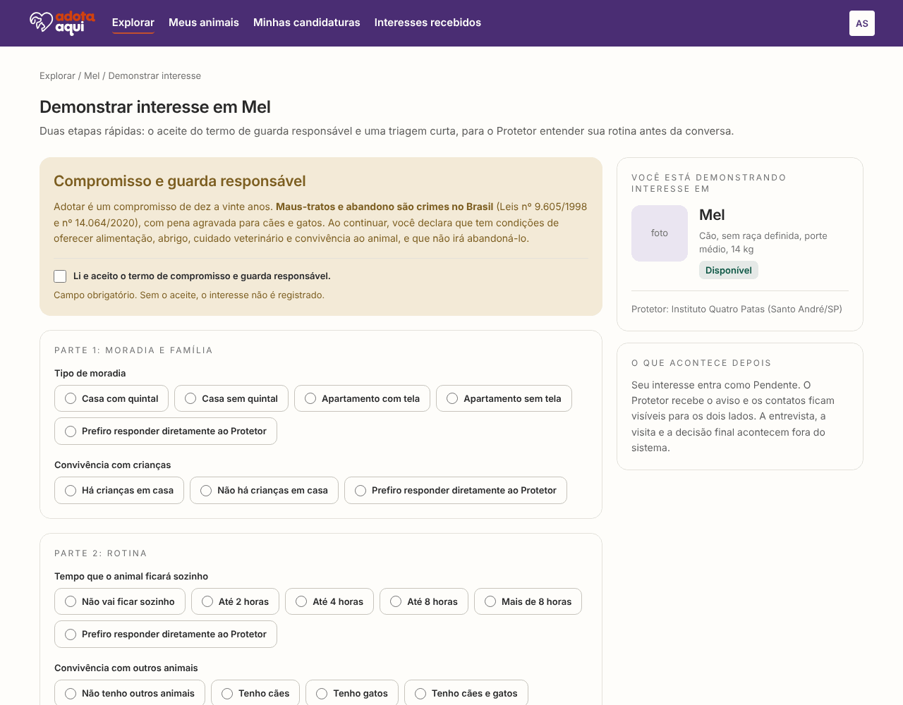

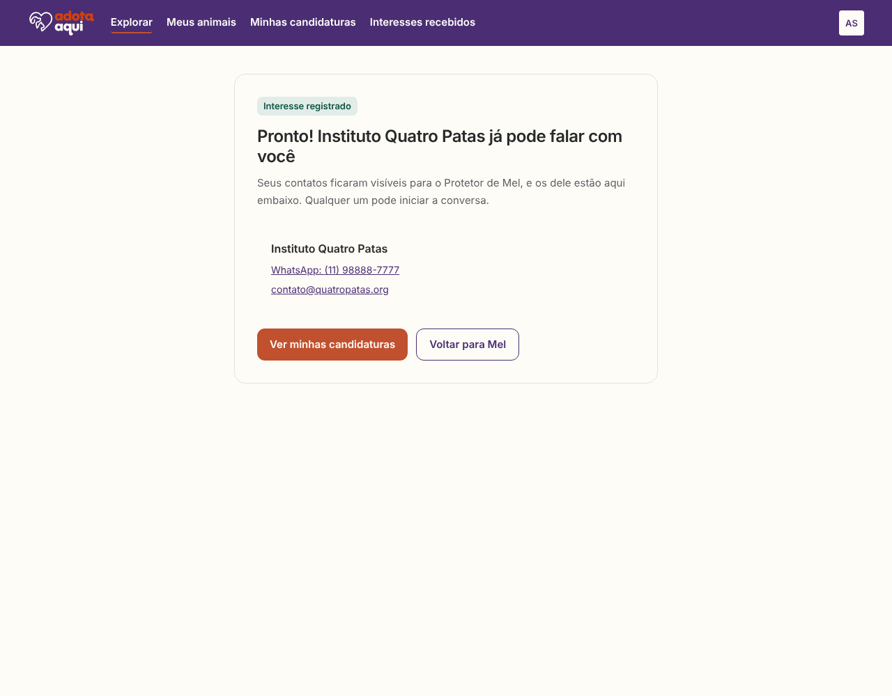

**O que faz.** A pessoa física aceita o termo de guarda responsável, responde uma triagem curta e registra o interesse em um animal (RF08, RF13, RF15, UC07). Na hora, os contatos ficam visíveis pros dois lados (RF09): ela vê o WhatsApp e o e-mail do protetor, e o protetor vê os dela no painel.

**Como funciona.**

1. No perfil do animal, "Quero conhecer {nome}". Visitante vai pro login antes.
2. Compromisso e guarda responsável: o texto com as leis (9.605/1998 e 14.064/2020) e a caixa "Li e aceito o termo de compromisso e guarda responsável.". Sem marcar, não dá pra continuar.
3. Triagem em três partes: moradia e família (tipo de moradia, crianças), rotina (tempo sozinho, outros animais, viagens) e contato (melhor momento). Nas duas primeiras, toda pergunta tem a opção "Prefiro responder diretamente ao Protetor". A de contato não tem, porque é ela que faz a ponte funcionar.
4. "Confirmar interesse" manda tudo pro `POST /api/animais/{id}/interesses`. O interesse começa como Pendente.
5. Tela de confirmação: "Pronto! {protetor} já pode falar com você", com o link do WhatsApp e o e-mail do protetor.

**Desistir.** Com o interesse Pendente ou Em contato, o perfil do animal mostra "Desistir da adoção". Depois da confirmação, o front chama `DELETE /api/interesses/{id}` e o interesse é apagado.

**Regras, na ordem em que o back confere.**

1. Sem login: `401`.
2. Termo não aceito ou triagem incompleta (as seis respostas são obrigatórias): `400`.
3. Conta de abrigo: `403` "Contas de abrigo não demonstram interesse. Para adotar, use uma conta pessoal (CPF)".
4. Animal que não existe: `404`.
5. Animal da própria pessoa: `403`.
6. Animal de outro estado: `403` "Só é possível demonstrar interesse em animais do seu estado" (RF14).
7. Animal que não está disponível: `409`.
8. Já existe um interesse Pendente ou Em contato da pessoa nesse animal: `409` "Você já demonstrou interesse neste animal".

Só quem demonstrou o interesse desiste dele, e só enquanto ele está Pendente ou Em contato.

**Como fica no banco.** Tabela `interesse`: data e hora, status, motivo da descontinuação, as seis respostas da triagem, o candidato e o animal. Uma regra do banco (`CHECK`) exige o motivo quando o status é Descontinuado.

**Onde está no código.**

- Front: `pages/DemonstrarInteresse`, `utils/triagem.js` e `services/interesses.js`
- Back: `InteresseController`, `InteresseService` e `InteresseMapper`

**Testes.** `InteresseIntegrationTest`, `DemonstrarInteresse.test.jsx` e `triagem.test.js`.

---

## 8. Painel de interesses recebidos

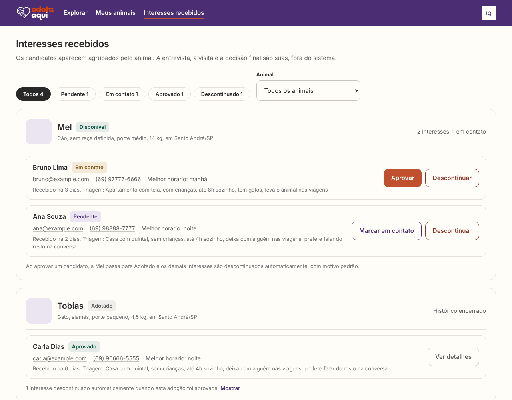

**O que faz.** O protetor vê quem demonstrou interesse nos animais dele, com contatos e triagem, e registra o andamento de cada candidato até a adoção (RF09, RF10, UC08). No MVP, a notificação do RF09 é o próprio painel: interesse novo aparece como Pendente. Não tem envio de e-mail.

**Como funciona.**

1. Os candidatos aparecem agrupados por animal. Cada cartão tem a foto, o nome e o status do animal, e um resumo ("2 interesses, 1 em contato" ou "Histórico encerrado"). Essa contagem só o protetor vê (RF12).
2. Em cada candidato: nome, status, e-mail, WhatsApp, melhor horário e a triagem resumida numa frase.
3. Filtros por status (Todos, Pendente, Em contato, Aprovado e Descontinuado, cada um com a quantidade) e por animal. O animal escolhido fica no endereço (`?animal=id`), por isso o "Ver interesses" de Meus animais já abre filtrado.
4. Ações:
   - Pendente: "Marcar em contato" ou "Descontinuar".
   - Em contato: "Aprovar" ou "Descontinuar".
   - Aprovado e Descontinuado: só "Ver detalhes", com a triagem completa.
5. Descontinuar pede um motivo de até 255 caracteres, que o candidato vai ler. Aprovar pede confirmação.
6. Os descontinuados ficam recolhidos no fim de cada cartão, com o botão "Mostrar".

**O que acontece ao aprovar (RF10).** Tudo numa transação só:

1. o interesse vira Aprovado;
2. o animal vira Adotado e sai da vitrine;
3. os outros interesses Pendente ou Em contato do mesmo animal viram Descontinuado, com o motivo "Outro candidato foi aprovado para este animal.".

Se qualquer parte falhar, nada é salvo. O animal fica travado no banco durante a operação, então duas aprovações ao mesmo tempo não geram duas adoções: uma passa e a outra recebe `409`.

**Regras.**

- Só o protetor do animal mexe nos interesses dele: `403` "Somente o protetor do animal pode gerenciar este interesse".
- Transições permitidas: de Pendente para Em contato, Aprovado ou Descontinuado; de Em contato para Aprovado ou Descontinuado. Aprovado e Descontinuado não mudam mais. Qualquer outra: `409` "Transição de status não permitida para este interesse".
- Descontinuar sem motivo: `400`. Aprovar um animal que já foi adotado: `409` "Este animal já está adotado".
- O painel não mostra "Aprovar" pra quem está Pendente. Segue o fluxo do Figma, em que primeiro se conversa (Em contato) e depois se aprova, mas a API aceita a aprovação direta.

**Onde está no código.**

- Front: `pages/InteressesRecebidos`, `components/InteressesDoAnimal` e `components/InteresseRecebido`
- Back: `InteresseController`, `InteresseService` e `InteresseRepository`

**Testes.** `InteresseIntegrationTest` (filtros, dono, transições, aprovação, aprovações ao mesmo tempo, transação desfeita quando algo falha) e `InteressesRecebidos.test.jsx`.

---

## 9. O que vale pro sistema todo

- **Erros no mesmo formato.** Toda resposta de erro da API tem `status`, `erro`, `mensagem`, `campos` (quando o erro é num campo) e `timestamp`, em português. O front mostra a `mensagem` e põe cada erro de `campos` embaixo do campo certo (`GlobalExceptionHandler`, `ErroResponse` e `services/api.js`).
- **Servidor acordando.** O Render desliga a API depois de 15 minutos sem uso. Quando uma tela passa de 4 segundos carregando, aparece "O servidor estava parado e está acordando. Isso pode levar até 1 minuto." (`components/Carregando`).
- **Responsivo (RNF01).** As telas funcionam no celular, no tablet e no computador, seguindo os três tamanhos do Figma.
- **Página não encontrada** pra qualquer endereço que não existe.
- **Integração contínua.** A cada push e PR na `dev` e na `main`, o GitHub Actions roda os testes do back (`mvn verify`) e do front (build e `npm run test:coverage`) e guarda os relatórios de cobertura (JaCoCo e lcov). O PR só entra com os dois verdes.
- **Deploy (RNF06).** Front no Netlify, API no Render (com Docker), banco PostgreSQL no Neon e fotos no Amazon S3. Os endereços estão no [README principal](../README.md).

---

## 10. O que ainda não está pronto

| O quê | Situação |
| --- | --- |
| Minhas candidaturas (`/meus-interesses`) | A tela ainda é só o título, e não existe endpoint que liste os interesses da pessoa. O menu e a tela de confirmação já levam pra ela |
| Editar perfil e trocar senha (RF17, UC10) | Os DTOs existem, mas ainda não há endpoint nem tela. Meu perfil só tem "Sair da conta" |
| Apagar a imagem do S3 | Remover uma foto ou um animal tira o endereço do banco, mas o arquivo continua no S3 |
| Paginação e ordem na vitrine | A vitrine traz todos os animais de uma vez, sem uma ordem definida |
| Cobertura mínima obrigatória (RNF04) | A cobertura é medida no CI, mas o build ainda não falha quando fica abaixo de 70% |

---

## Como atualizar este documento

1. Funcionalidade nova ganha uma seção nova, com as mesmas partes: o que faz, como funciona, regras, onde está no código, testes e print.
2. Os prints ficam em `docs/prints/`, com número e nome da tela (por exemplo, `12-minhas-candidaturas.png`). Pode ser do site de verdade ou do ambiente local.
3. Mudou uma regra? Atualiza aqui e no `api.md` no mesmo PR.
